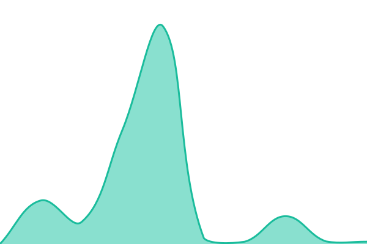
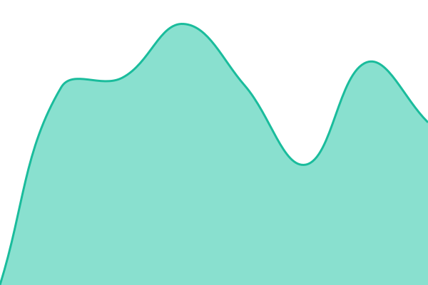

# [📈 Live Status](https://demo.upptime.js.org): <!--live status--> **🟩 All systems operational**

This repository contains the open-source uptime monitor and status page for [Upptime](https://upptime.js.org), powered by [Upptime](https://github.com/upptime/upptime).

With [Upptime](https://upptime.js.org), you can get your own unlimited and free uptime monitor and status page, powered entirely by a GitHub repository. We use [Issues](https://github.com/upptime/upptime/issues) as incident reports, [Actions](https://github.com/upptime/upptime/actions) as uptime monitors, and [Pages](https://demo.upptime.js.org) for the status page.

<!--start: status pages-->
<!-- This summary is generated by Upptime (https://github.com/upptime/upptime) -->
<!-- Do not edit this manually, your changes will be overwritten -->
<!-- prettier-ignore -->
| URL | Status | History | Response Time | Uptime |
| --- | ------ | ------- | ------------- | ------ |
|  [Wattnet (Main Website)](https://wattnet.eu) | 🟩 Up | [wattnet-main-website.yml](https://github.com/wattnet/wattnet-status/commits/HEAD/history/wattnet-main-website.yml) | 

 0ms
     
 | 

<a href="https://wattnet.github.io/wattnet-status/history/wattnet-main-website">100.00%</a>
    

|  [Auth](https://auth.wattnet.eu) | 🟩 Up | [auth.yml](https://github.com/wattnet/wattnet-status/commits/HEAD/history/auth.yml) | 

 1067ms
     
 | 

<a href="https://wattnet.github.io/wattnet-status/history/auth">100.00%</a>
    

|  [API](https://api.wattnet.eu) | 🟩 Up | [api.yml](https://github.com/wattnet/wattnet-status/commits/HEAD/history/api.yml) | 

 972ms
     
 | 

<a href="https://wattnet.github.io/wattnet-status/history/api">100.00%</a>
    

|  [Dashboard](https://dashboard.wattnet.eu) | 🟩 Up | [dashboard.yml](https://github.com/wattnet/wattnet-status/commits/HEAD/history/dashboard.yml) | 

 379ms
     
 | 

<a href="https://wattnet.github.io/wattnet-status/history/dashboard">100.00%</a>
    

|  [Docs](https://docs.wattnet.eu) | 🟩 Up | [docs.yml](https://github.com/wattnet/wattnet-status/commits/HEAD/history/docs.yml) | 

 516ms
     
 | 

<a href="https://wattnet.github.io/wattnet-status/history/docs">100.00%</a>
    

|  [ENTSO-E Transparency Platform](https://web-api.tp.entsoe.eu/api) | 🟩 Up | [entso-e-transparency-platform.yml](https://github.com/wattnet/wattnet-status/commits/HEAD/history/entso-e-transparency-platform.yml) | 

 613ms
     
 | 

<a href="https://wattnet.github.io/wattnet-status/history/entso-e-transparency-platform">100.00%</a>
    

|  [Elexon Insights Solution](https://data.elexon.co.uk/bmrs/api/v1/datasets/FREQ) | 🟩 Up | [elexon-insights-solution.yml](https://github.com/wattnet/wattnet-status/commits/HEAD/history/elexon-insights-solution.yml) | 

 891ms
     
 | 

<a href="https://wattnet.github.io/wattnet-status/history/elexon-insights-solution">100.00%</a>
    

|  [EPIAS Transparency Platform](https://seffaflik.epias.com.tr/electricity-service/v1/consumption/data/distribution-region) | 🟩 Up | [epias-transparency-platform.yml](https://github.com/wattnet/wattnet-status/commits/HEAD/history/epias-transparency-platform.yml) | 

 724ms
     
 | 

<a href="https://wattnet.github.io/wattnet-status/history/epias-transparency-platform">100.00%</a>
    

<!--end: status pages-->

[**Visit our status website →**](https://demo.upptime.js.org)

## 📄 License

- Powered by: [Upptime](https://github.com/upptime/upptime)
- Code: [MIT](./LICENSE) © [Anand Chowdhary](https://anandchowdhary.com)
- Data in the `./history` directory: [Open Database License](https://opendatacommons.org/licenses/odbl/1-0/)
