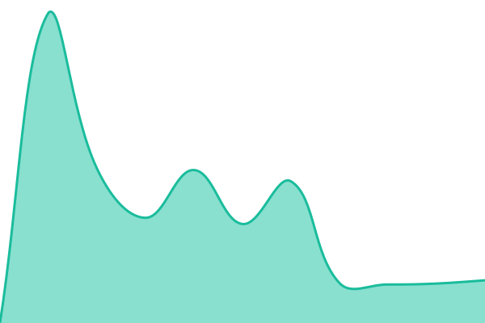

  <picture>
    <source media="(prefers-color-scheme: dark)"
            srcset="https://github.com/wattnet/.github/raw/main/images/wattnet-logo-full-dark-transparent-cropped.png" />
    <source media="(prefers-color-scheme: light)"
            srcset="https://github.com/wattnet/.github/raw/main/images/wattnet-logo-full-light-transparent-cropped.png" />
    
  </picture>

# [📈 Live Status](https://status.wattnet.eu): <!--live status--> **🟩 All systems operational**

This repository contains the open-source uptime monitor and status page for [Wattnet](https://wattnet.eu), powered by [Upptime](https://github.com/upptime/upptime).

With [Upptime](https://upptime.js.org), you can get your own unlimited and free uptime monitor and status page, powered entirely by a GitHub repository. We use [Issues](https://github.com/upptime/upptime/issues) as incident reports, [Actions](https://github.com/upptime/upptime/actions) as uptime monitors, and [Pages](https://demo.upptime.js.org) for the status page.

<!--start: status pages-->
<!-- This summary is generated by Upptime (https://github.com/upptime/upptime) -->
<!-- Do not edit this manually, your changes will be overwritten -->
<!-- prettier-ignore -->
| URL | Status | History | Response Time | Uptime |
| --- | ------ | ------- | ------------- | ------ |
|  [Wattnet Website](https://wattnet.eu) | 🟩 Up | [wattnet-website.yml](https://github.com/wattnet/wattnet-status/commits/HEAD/history/wattnet-website.yml) | 

 670ms
     
 | 

<a href="https://status.wattnet.eu/history/wattnet-website">91.94%</a>
    

|  [Authentication Service](https://auth.wattnet.eu) | 🟩 Up | [authentication-service.yml](https://github.com/wattnet/wattnet-status/commits/HEAD/history/authentication-service.yml) | 

 1488ms
     
 | 

<a href="https://status.wattnet.eu/history/authentication-service">100.00%</a>
    

|  [API Service](https://api.wattnet.eu) | 🟩 Up | [api-service.yml](https://github.com/wattnet/wattnet-status/commits/HEAD/history/api-service.yml) | 

 1101ms
     
 | 

<a href="https://status.wattnet.eu/history/api-service">100.00%</a>
    

|  [Web Dashboard](https://dashboard.wattnet.eu) | 🟩 Up | [web-dashboard.yml](https://github.com/wattnet/wattnet-status/commits/HEAD/history/web-dashboard.yml) | 

 510ms
     
 | 

<a href="https://status.wattnet.eu/history/web-dashboard">100.00%</a>
    

|  [Documentation](https://docs.wattnet.eu) | 🟩 Up | [documentation.yml](https://github.com/wattnet/wattnet-status/commits/HEAD/history/documentation.yml) | 

 487ms
     
 | 

<a href="https://status.wattnet.eu/history/documentation">91.94%</a>
    

|  [Grafana](https://grafana.wattnet.eu) | 🟩 Up | [grafana.yml](https://github.com/wattnet/wattnet-status/commits/HEAD/history/grafana.yml) | 

 1173ms
     
 | 

<a href="https://status.wattnet.eu/history/grafana">100.00%</a>
    

|  [Analytics](https://analytics.wattnet.eu) | 🟩 Up | [analytics.yml](https://github.com/wattnet/wattnet-status/commits/HEAD/history/analytics.yml) | 

 574ms
     
 | 

<a href="https://status.wattnet.eu/history/analytics">100.00%</a>
    

|  [ENTSO-E Transparency Platform](https://web-api.tp.entsoe.eu/api) | 🟩 Up | [entso-e-transparency-platform.yml](https://github.com/wattnet/wattnet-status/commits/HEAD/history/entso-e-transparency-platform.yml) | 

 2645ms
     
 | 

<a href="https://status.wattnet.eu/history/entso-e-transparency-platform">100.00%</a>
    

|  [Elexon Insights Solution](https://data.elexon.co.uk/bmrs/api/v1/datasets/FREQ) | 🟩 Up | [elexon-insights-solution.yml](https://github.com/wattnet/wattnet-status/commits/HEAD/history/elexon-insights-solution.yml) | 

 980ms
     
 | 

<a href="https://status.wattnet.eu/history/elexon-insights-solution">100.00%</a>
    

|  [EPIAS Transparency Platform](https://seffaflik.epias.com.tr/electricity-service/technical/tr/index.html) | 🟩 Up | [epias-transparency-platform.yml](https://github.com/wattnet/wattnet-status/commits/HEAD/history/epias-transparency-platform.yml) | 

 461ms
     
 | 

<a href="https://status.wattnet.eu/history/epias-transparency-platform">100.00%</a>
    

<!--end: status pages-->

[**Visit our status website →**](https://status.wattnet.eu)

## 📄 License

- Powered by: [Upptime](https://github.com/upptime/upptime)
- Code: [MIT](./LICENSE) © [Anand Chowdhary](https://anandchowdhary.com)
- Data in the `./history` directory: [Open Database License](https://opendatacommons.org/licenses/odbl/1-0/)

##### © 2026 Spanish National Research Council (CSIC). All rights reserved.
